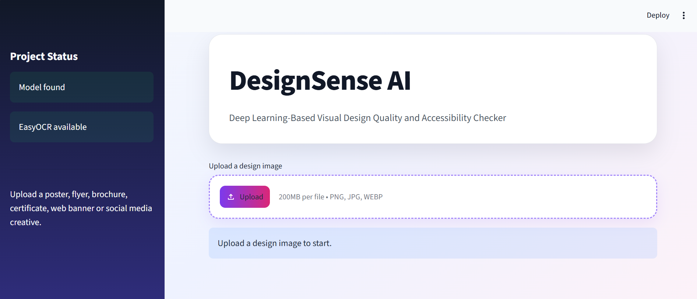
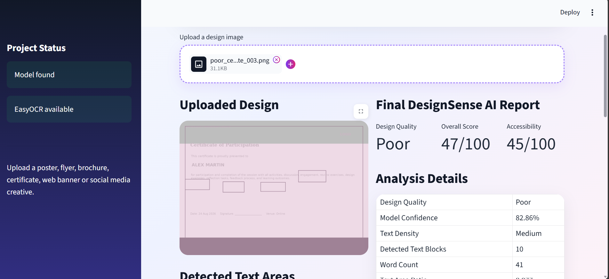
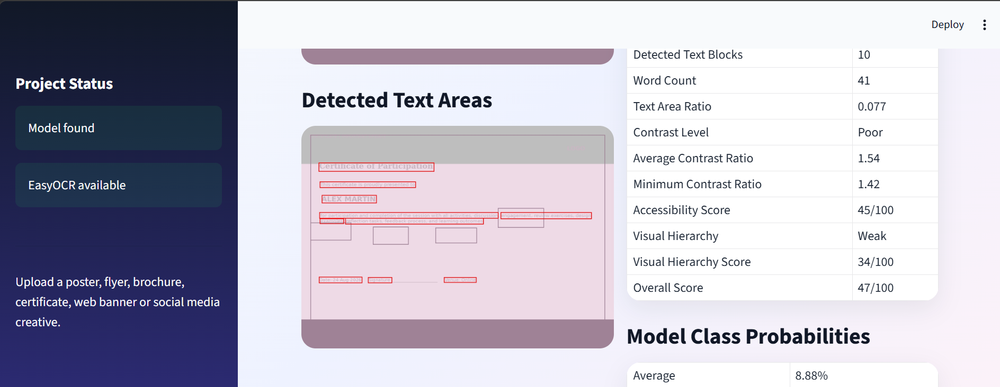
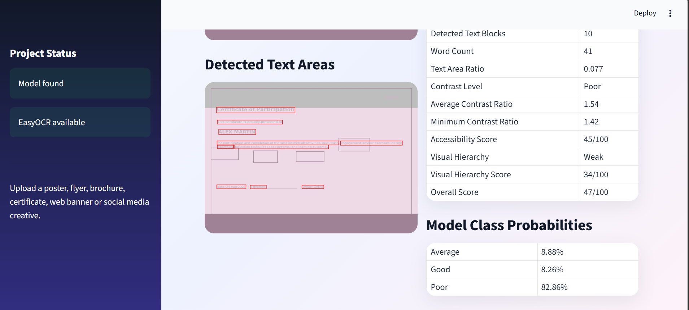
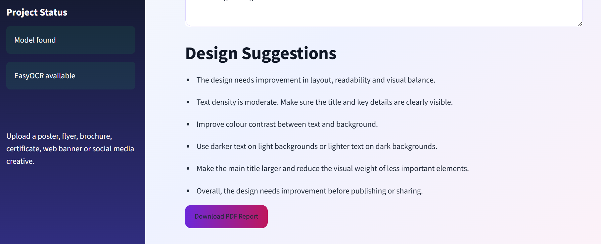
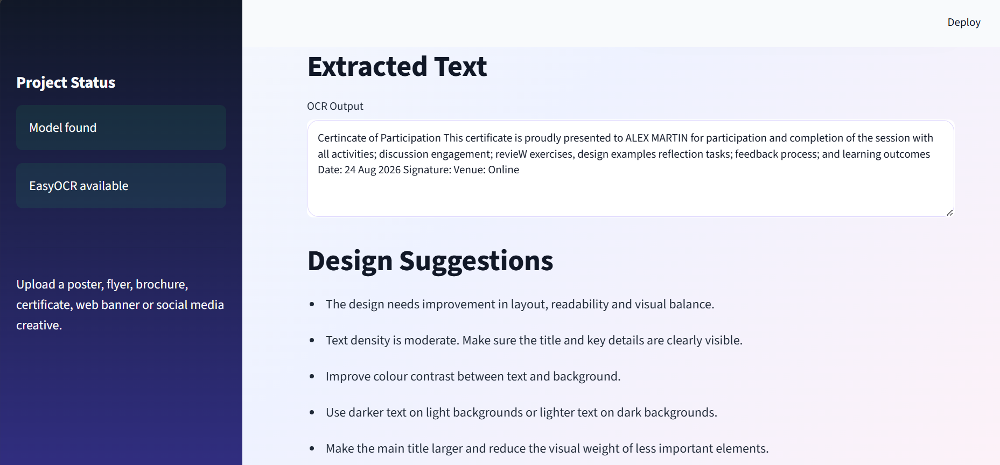

# DESIGNSENSE AI: VISUAL DESIGN QUALITY CHECKER

DesignSense AI is a deep learning-based web application that analyses visual design quality and accessibility. The system allows users to upload posters, flyers, banners, certificates and similar visual designs, then classifies them as **Good**, **Average** or **Poor** using a CNN-based MobileNetV2 transfer learning model.

---

## Project Overview

This project combines deep learning, computer vision and accessibility analysis to evaluate the readability and visual quality of design images. Along with design-quality prediction, the application provides insights such as OCR-based text extraction, text density, contrast level, accessibility score, visual hierarchy score, improvement suggestions and a final design quality report.

---

## Screenshots

### Upload Interface


### Design Quality Analysis Report


### Detected Text Areas and Model Probabilities


### Detailed Analysis Output


### Design Suggestions


### Extracted Text Output

---

## Features

- Classifies uploaded designs as **Good**, **Average** or **Poor**
- Uses **MobileNetV2 transfer learning** for image classification
- Extracts text from design images using **EasyOCR**
- Analyses contrast, text density, accessibility and visual hierarchy
- Displays prediction confidence and class probabilities
- Provides improvement suggestions based on design issues
- Generates a final design quality report through an interactive Streamlit dashboard

---

## Tech Stack

- Python
- TensorFlow / Keras
- MobileNetV2
- Streamlit
- EasyOCR
- OpenCV
- NumPy
- Pillow
- Matplotlib

---

## Model Architecture

The project uses **MobileNetV2** as a pre-trained CNN feature extractor. The original classification layer is removed and a custom Dense Softmax layer is added to classify design images into three classes:

- Good
- Average
- Poor

The model was trained using transfer learning to improve performance on a custom design-quality dataset.

---

## Evaluation

The model was evaluated using training and validation accuracy.

| Metric | Value |
|---|---:|
| Training Accuracy | 88% |
| Validation Accuracy | 80% |

Validation accuracy is considered the main performance indicator because it shows how well the model performs on unseen design images.

---

## Streamlit Dashboard Output

The dashboard displays:

- Predicted design quality
- Model confidence score
- Class probability distribution
- Text density level
- Contrast analysis
- Accessibility score
- Visual hierarchy score
- Overall design quality score
- Improvement suggestions

---

## Project Workflow

1. Upload a design image
2. Preprocess the image
3. Predict design quality using MobileNetV2
4. Extract text using OCR
5. Analyse contrast, text density and hierarchy
6. Generate accessibility and overall design scores
7. Display suggestions and final report

---

## How to Run

```bash
pip install -r requirements.txt
streamlit run app.py
